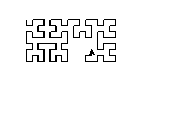

# Computação Gráfica - Labirinto 🖼️

<f2 align = "left"> **O seguinte projeto possui o objetivo de construir um labirinto por meio de conhecimentos com fractal Hilbert.**</f2> 

 

# Importando o módulo Turtle

Para utilizar um módulo no Python, utilizamos o comando import (importar) seguido do nome do módulo que queremos importar. Após a importação, já podemos utilizar todos os objetos e funções que o módulo disponibiliza.
   
  
    import turtle

Para definir uma função para desenhar a curva de Hilbert recursivamente, use:
   
  
    def hilbert(turtle, order, size, angle):
    if order == 0:
        return
    else:
        turtle.right(angle)
        hilbert(turtle, order-1, size, -angle)
        turtle.forward(size)
        turtle.left(angle)
        hilbert(turtle, order-1, size, angle)
        turtle.forward(size)
        hilbert(turtle, order-1, size, angle)
        turtle.left(angle)
        turtle.forward(size)
        hilbert(turtle, order-1, size, -angle)
        turtle.right(angle)
  

 Cria uma janela gráfica de tartaruga: 

    wn = turtle.Screen()
    wn.bgcolor("white")
    wn.title("Hilbert Fractal")

 Crie agora, uma tartaruga e defina suas propriedades:

  
    tess = turtle.Turtle()
    tess.speed(0)
    tess.penup()
    tess.goto(-200, 0)
    tess.pendown()
    tess.pensize(2)

 Chame a função Hilbert para desenhar o fractal:

    hilbert(tess, 5, 10, 90)

 Feche a janela de gráficos da tartaruga ao clicar:

    turtle.done()
